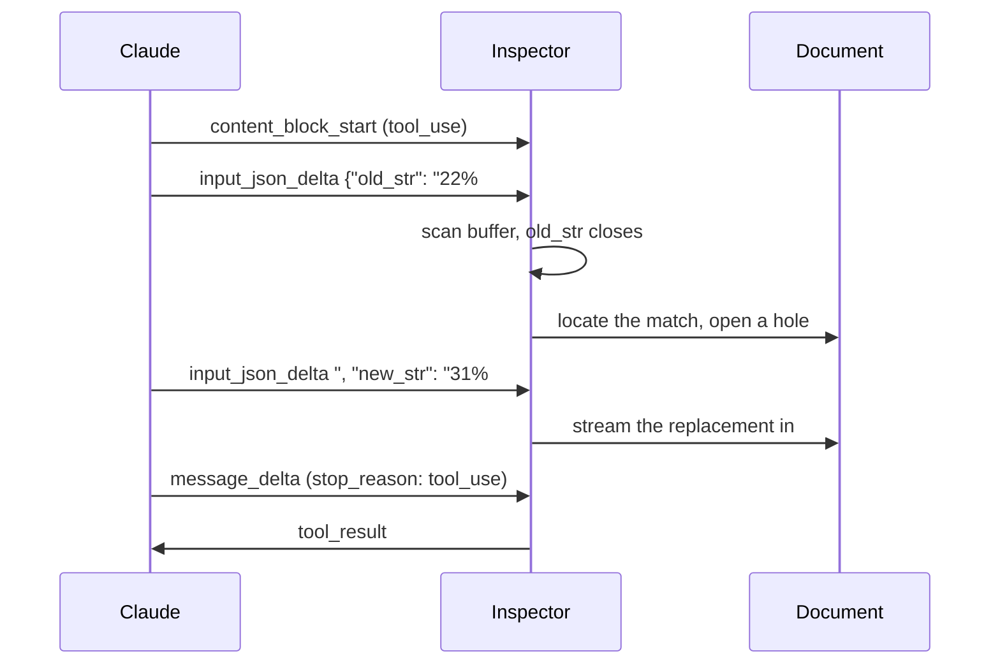

# Text Editor Tool Inspector

Claude edits a Markdown document through a `str_replace` tool with every mechanism on screen: the JSON fragments on the wire, the buffer they build, the match that lands or gets refused, and the document mutation that follows.

**[Try it live](https://bendrucker.github.io/anthropic-text-editor-inspector/)** with your own Anthropic API key.

The API reference tells you `eager_input_streaming` exists. This app shows what changes when you turn it on.

## One Edit, Start to Finish



`old_str` closes about a third of the way through a typical call.

## What You Can Watch

**The run inspector** interleaves wire events and this app's decisions in one timeline.

**The input buffer** shows tool input as one growing string. `old_str` and `new_str` appear live, each labeled *not started*, *streaming*, or *closed*.

**The matcher** runs the real matching code against the live document with no model and no API key. Type `Commit` and get the four-match rejection verbatim.

**Ambiguity traps** are built into the document. Three suggested prompts, labeled as traps, each name something appearing more than once, so the model's first `old_str` gets refused.

**Replay** re-runs a finished edit at quarter speed. The live run is never throttled.

## What You Can Change

- **Prompt rules.** On, the system prompt pre-teaches uniqueness and table padding. Off, the model learns them from tool results and the retry loop runs. Turn this off before trying the traps.
- **old_str first.** Schema key order. Flip it and the target stays unknown until the replacement has fully streamed, leaving the document inert until the end. Order-follows-schema is observed model behavior rather than a spec guarantee.
- **Eager streaming.** Off, tool input lands in validated bursts and nothing can render early.

Model, effort, and fast mode live in the header.

## Why a Custom Tool

The built-in `text_editor_20250728` is Anthropic-defined and its schema carries no streaming control. A user-defined tool does, via `eager_input_streaming: true`. This app declares its own `str_replace` to reach that flag.

Match semantics follow Claude Code's Edit tool: exact and unique, or refused. Error messages are written to work as retry prompts.

[docs/mechanics.md](docs/mechanics.md) covers the rest.

## Your API Key

There is no server and no telemetry. The browser calls `api.anthropic.com` directly. Your key goes nowhere else.

The key lives in `localStorage`, which any script on the origin can read. Use a key you can revoke.

## Running It

```bash
bun install
bun run dev
```

```bash
bun run build          # dist/, any static host
bun run build:single   # one self-contained index.html
bun run roundtrip      # serializer fixed-point check
bun run typecheck
```
