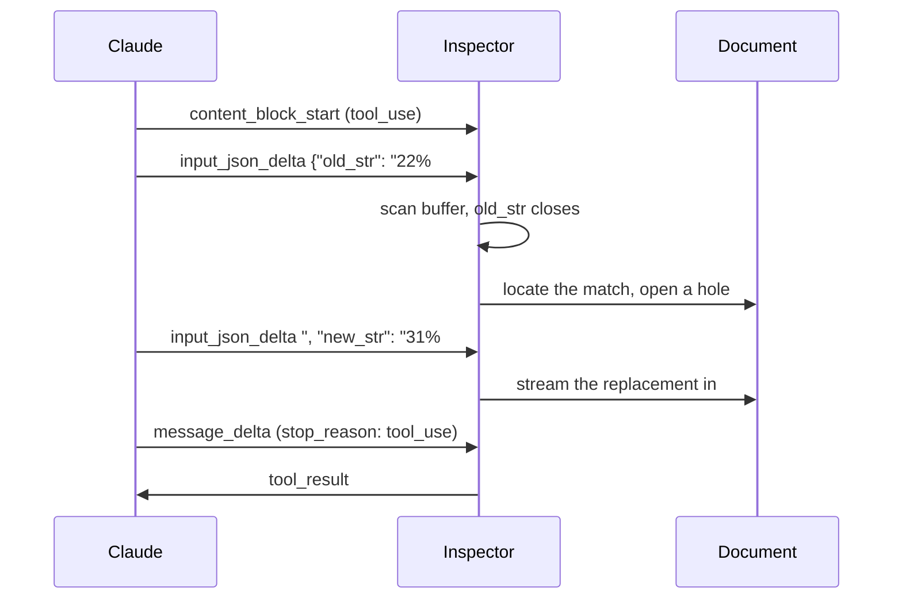

# Text Editor Tool Inspector

> Demonstrates the inner workings of Anthropic's [text editor tool](https://platform.claude.com/docs/en/agents-and-tools/tool-use/text-editor-tool) by providing visibility into the internals of a text editor chatbot

**[Open Web App](https://bendrucker.github.io/anthropic-text-editor-inspector/)**


## Getting Started

This application is bring-your-own-key (BYOK). You must first create an [API key](https://platform.claude.com/dashboard) from your Claude organization. This key is stored on your device and only sent to Anthropic's servers.

Step three is the point. Schema key order decides how early anything downstream can act on a tool call.

## Sequence



## Observability

- **Run inspector:** interleaves wire events and this app's decisions in one timeline.
- **Input buffer:** shows tool input as one growing string, with `old_str` and `new_str` extracted live and labeled *not started*, *streaming*, or *closed*.
- **Matcher:** runs the real matching code against the live document with no model or API key.
- **Replay:** re-runs a finished edit at quarter speed.

## Controls

- **Prompt rules:** On, the system prompt pre-teaches uniqueness and table padding. Off, the model learns them from tool results and the retry loop runs. Turn it off before trying the traps.
- **old_str first:** Schema key order. Flipped, the target stays unknown until the replacement fully streams. Order-follows-schema is observed model behavior rather than a spec guarantee.
- **Eager streaming:** Off, tool input lands in validated bursts and nothing renders early.

Model, effort, and fast mode are controllable from the header.

## Editor Tool

The built-in `text_editor_20250728` is a native tool, but does not stream outputs. A user-defined tool can set `eager_input_streaming: true`, so this app declares its own `str_replace`.

Match semantics follow Claude Code's `Edit` tool. Matches must be exact and unique or they are refused. Error messages double as retry prompts.

## CORS

Organizations with [zero data retention](https://code.claude.com/docs/en/zero-data-retention) enabled cannot call Anthropic APIs directly from the browser. You must use a native build or clone and `bun run dev`.

## Building Locally

```bash
bun run build
```

It is is a single-page web app, so you can open the resulting `index.html` file. Use `build:single` to build a self-contained `index.html` with no external scripts or styles.
