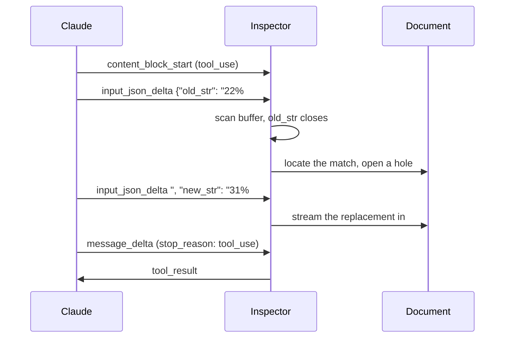

# Text Editor Tool Inspector

Claude edits a Markdown document through a user-defined `str_replace` tool while every mechanism behind the edit stays on screen: the JSON fragments on the wire, the buffer they build, the match that lands or gets refused, and the document mutation that follows.

**[Open the inspector](https://bendrucker.github.io/anthropic-text-editor-inspector/)**

The API reference tells you `eager_input_streaming` exists. This app shows what it does.

## Start Here

The matcher needs no key and no network. Open it and type `Passable`. Trail Conditions says it five times, so the match is refused, in the exact words Claude gets back. Extend it to `Passable throughout` and it resolves to one hit. That is the whole contract of `str_replace`, and everything else is built on it.

With a key, three runs in order:

1. Send a suggested edit and watch the input buffer. `old_str` closes about a third of the way through the call, and the document opens a hole before `new_str` has finished arriving.
2. Turn off **Prompt rules** and run a trap suggestion. Claude's first `old_str` matches too many places, the tool result says so, and it retries with more context.
3. Turn off **old_str first** and repeat. The document now sits inert until the call completes.

Step three is the point. Schema key order decides how early anything downstream can act on a tool call.

## One Edit, Start to Finish



## What You Can Watch

**The run inspector** interleaves wire events and this app's decisions in one timeline.

**The input buffer** shows tool input as one growing string, with `old_str` and `new_str` extracted live and labeled *not started*, *streaming*, or *closed*.

**The matcher** runs the real matching code against the live document with no model or API key.

**Ambiguity traps** are derived from whichever document is loaded, including generated ones. Each names something appearing more than once.

**Replay** re-runs a finished edit at quarter speed. The live run is never throttled.

## What You Can Change

- **Prompt rules.** On, the system prompt pre-teaches uniqueness and table padding. Off, the model learns them from tool results and the retry loop runs. Turn it off before trying the traps.
- **old_str first.** Schema key order. Flipped, the target stays unknown until the replacement fully streams. Order-follows-schema is observed model behavior rather than a spec guarantee.
- **Eager streaming.** Off, tool input lands in validated bursts and nothing renders early.

Model, effort, and fast mode live in the header.

## Why a Custom Tool

The built-in `text_editor_20250728` carries no streaming control in its schema. A user-defined tool does, via `eager_input_streaming: true`, so this app declares its own `str_replace`.

Match semantics follow Claude Code's Edit tool: exact and unique, or refused. Error messages double as retry prompts.

[docs/mechanics.md](docs/mechanics.md) covers the rest.

## Your API Key

There is no server and no telemetry. The key lives in `localStorage`, which any script on the origin can read. Use a key you can revoke.

## Organization Restrictions

An organization with custom data retention gets browser requests refused:

> CORS requests are not allowed for this Organization because of custom retention settings.

Nothing in the app changes that, and the hosted link cannot work around it. The request has to leave something other than a browser. There are two ways to get one.

**The desktop build** is the easy one. Rust makes the request, so there is no origin to refuse and nothing to configure. Download it from [Releases](https://github.com/bendrucker/anthropic-text-editor-inspector/releases). It stores your key in the Keychain instead of `localStorage`.

**Running it locally** works without downloading anything, because the dev server forwards the request for you:

```bash
bun install
bun run dev
```

Your key still lives in your browser and still travels no further than your own machine. A web build hosted somewhere other than a developer's laptop can point at its own proxy with `VITE_ANTHROPIC_BASE_URL`.

## Running It

```bash
bun run build          # dist/, any static host
bun run build:single   # one self-contained index.html
bun run desktop        # the Tauri app, against the dev server
bun run desktop:build  # a .dmg
bun run roundtrip      # serializer fixed-point check
bun run conversation   # history threading check
bun run typecheck
```
