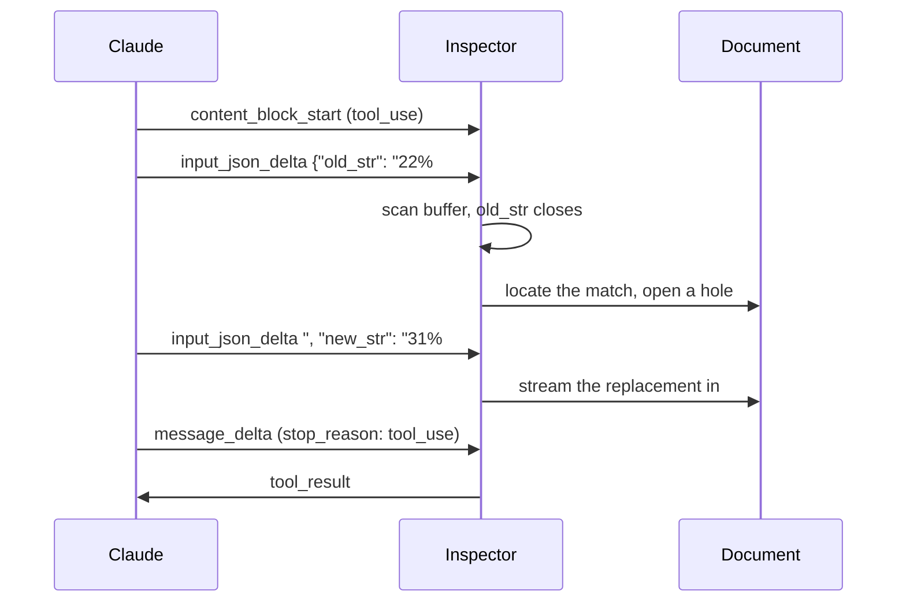

# Text Editor Tool Inspector

> Demonstrates the inner workings of Anthropic's [text editor tool](https://platform.claude.com/docs/en/agents-and-tools/tool-use/text-editor-tool) by providing visibility into the internals of a text editor chatbot

**[Open Web App](https://bendrucker.github.io/anthropic-text-editor-inspector/)**


## Getting Started

This application is bring-your-own-key (BYOK). You must first create an [API key](https://platform.claude.com/dashboard) from your Claude organization. This key is stored on your device and only sent to Anthropic's servers.

## Dev Server Key

Set `ANTHROPIC_API_KEY` in your shell or in a gitignored `.env.local`. `bun run dev` then authenticates for you: the dev server forwards requests to the API and attaches the key on the way through, so the browser never receives it. A badge naming the dev server as the key source replaces the prompt, and a key you pasted earlier is ignored while the variable is set.

Only the dev server supplies a key this way. `bun run preview` serves a build over a server too and deliberately attaches nothing, since that would leave an authenticated relay listening on the port.

## Sequence



## Observability

- **Run inspector:** interleaves wire events and this app's decisions in one timeline.
- **Input buffer:** shows tool input as one growing string, with `old_str` and `new_str` extracted live and labeled *not started*, *streaming*, or *closed*.
- **Matcher:** runs the real matching code against the live document with no model or API key.
- **Replay:** re-runs a finished edit at quarter speed.

## Controls

- **Prompt rules:** On, the system prompt pre-teaches uniqueness and table padding. Off, the model learns them from tool results and the retry loop runs. Turn it off before trying the traps.
- **old_str first:** Schema key order. Flipped, the target stays unknown until the replacement fully streams. Order-follows-schema is observed model behavior rather than a spec guarantee.
- **Eager streaming:** Off, tool input lands in validated bursts and nothing renders early.

Model, effort, and fast mode are controllable from the header.

## Editor Tool

The built-in `text_editor_20250728` is a native tool, but does not stream outputs. A user-defined tool can set `eager_input_streaming: true`, so this app declares its own `str_replace`.

Match semantics follow Claude Code's `Edit` tool. Matches must be exact and unique or they are refused. Error messages double as retry prompts.

## CORS

Organizations with [zero data retention](https://platform.claude.com/docs/en/manage-claude/api-and-data-retention#what-zdr-does-not-cover) enabled cannot call Anthropic APIs directly from the browser. The [macOS desktop build](https://github.com/bendrucker/anthropic-text-editor-inspector/releases) issues requests from Rust, so it works with those keys. Cloning and running `bun run dev` works too, since the dev server forwards the request. Build the desktop app yourself with `bun run desktop:build`.

## Stack

- **[React](https://react.dev)**
- **[Vite](https://vite.dev):** builds the app, and its dev server forwards `/anthropic` for a local run.
- **[Tiptap](https://tiptap.dev):** the document is a Tiptap editor, and its Markdown serializer decides the exact text `str_replace` matches against.
- **[Anthropic TypeScript SDK](https://github.com/anthropics/anthropic-sdk-typescript):** streams the message and exposes the raw events the run inspector renders.
- **[Tauri](https://tauri.app):** the desktop build issues requests from Rust, so the restriction above does not apply, and it stores the key in the system keychain.

## Building Locally

```bash
bun run build
```

The build emits a `dist/` directory that has to be served, which `bun run preview` does locally. Use `build:single` for a self-contained `index.html` with no external scripts or styles, which does open straight from disk.
